<p align="center">
  
</p>

# Heart Disease MLOps


Aplicación MLOps completa para predecir riesgo de enfermedad cardíaca a partir de variables clínicas. El proyecto parte del taller base `Taller_PipelineModeling.zip` y lo transforma en una solución final con API, frontend, modelo versionado, monitorización, contenedores y documentación de presentación.

> Uso académico. Este sistema no sustituye una valoración médica real.

## 1. Descripción General

El proyecto expone un modelo de Machine Learning mediante una API FastAPI, permite hacer predicciones desde un frontend React moderno y publica métricas operativas para Prometheus y Grafana.

Servicios principales:

| Servicio | URL |
|---|---|
| Frontend React | http://localhost:3000 |
| API FastAPI | http://localhost:8000 |
| Swagger | http://localhost:8000/docs |
| Métricas | http://localhost:8000/metrics |
| Prometheus | http://localhost:9090 |
| Grafana | http://localhost:3001 |

## Demo Rápida Profesional

1. Levanta todos los servicios:

```bash
docker compose up --build
```

2. Abre el frontend en http://localhost:3000.
3. Introduce los datos del paciente y lanza una predicción.
4. Genera tráfico adicional para métricas:

```bash
python scripts/demo_requests.py --requests 25 --sleep 0.05
```

5. Abre Swagger en http://localhost:8000/docs y prueba `POST /predict`.
6. Revisa Prometheus en http://localhost:9090/targets y confirma que `heart-api` está `UP`.
7. Abre Grafana en http://localhost:3001/login y entra al dashboard `Heart Disease MLOps Observability`.

Guía completa: [`docs/demo-guide.md`](docs/demo-guide.md).

## 2. Objetivo

Convertir el taller inicial de despliegue de un modelo de enfermedad cardíaca en un proyecto final profesional de MLOps:

- API documentada y lista para integración.
- Modelo final v4.1 basado en red neuronal `MLPClassifier` balanceada con validación cruzada, búsqueda de hiperparámetros y threshold ajustado.
- Versionado de modelos en `models/`.
- Frontend visual, responsive y útil para una demo.
- Métricas compatibles con Prometheus.
- Dashboard de Grafana provisionado.
- Ejecución reproducible con Docker Compose.
- Tests básicos con `pytest`.
- Validación automática con GitHub Actions.

## 3. Problema Que Resuelve

El taller original permitía servir un modelo desde FastAPI, pero faltaban piezas habituales en un flujo MLOps completo: interfaz de usuario, versionado explícito, monitorización, despliegue multi-servicio y documentación de arquitectura.

Este proyecto permite introducir datos clínicos de un paciente, consultar la API, obtener una predicción interpretable y observar el comportamiento del sistema con métricas.

## 4. Análisis Del ZIP Base

El ZIP `Taller_PipelineModeling.zip` contiene:

| Archivo base | Uso en este proyecto |
|---|---|
| `api_heart.py` | Se tomó como referencia para los endpoints y métricas. |
| `heart_model_wrapper.py` | Se reutilizó la idea de encapsular inferencia y postprocesado. |
| `heart_disease_model.joblib` | Se conserva como modelo antiguo en `models/heart_model_v1_logistic.joblib`. |
| `Ejercicio_Practico_Despliegue_ML.ipynb` | Se resume en `docs/taller-base.md` para no arrastrar el notebook completo. |
| `requirements.txt` | Se actualizó para el backend moderno. |
| `Dockerfile` | Se sustituyó por un Dockerfile de backend dentro de `backend/`. |

No se encontró un CSV de dataset en el ZIP. El notebook base descargaba `heart-statlog` desde OpenML y, si fallaba, creaba un dataset sintético. En esta versión no se genera dataset sintético para evitar entrenar con datos inventados.

## 5. Tecnologías Usadas

| Área | Tecnología |
|---|---|
| API | FastAPI, Pydantic, Uvicorn |
| ML | scikit-learn, `StandardScaler`, `MLPClassifier`, `RandomizedSearchCV`, `StratifiedKFold`, joblib |
| Frontend | React, Vite, CSS responsive |
| Métricas | prometheus-client |
| Monitorización | Prometheus, Grafana |
| Contenedores | Docker, Docker Compose |
| Tests | pytest, FastAPI TestClient |
| CI/CD | GitHub Actions |

## Validación Automática Con GitHub Actions

El repositorio incluye `.github/workflows/ci.yml`. El workflow se ejecuta en cada Pull Request y en cada push a `main`.

Validaciones incluidas:

- Backend: instala Python, instala `backend/requirements.txt` y ejecuta `pytest`.
- Frontend: instala Node, ejecuta `npm ci` y `npm run build`.

## Calidad Técnica

El proyecto incluye varias piezas pensadas para que la entrega sea evaluable y mantenible:

| Área | Implementación |
|---|---|
| CI | GitHub Actions valida backend y frontend automáticamente. |
| Tests | `pytest` cubre salud, información, versión, predicción y métricas. |
| Docker Compose | Levanta API, frontend, Prometheus y Grafana con un solo comando. |
| Versionado de modelo | Los artefactos se conservan en `models/` y se cargan desde metadata. |
| Métricas | `/metrics` expone requests, errores, latencia e inferencias. |
| Model Card | `docs/model-card.md` documenta uso previsto, límites y riesgos. |
| Evaluación | `models/evaluation_report.json` registra búsqueda de hiperparámetros, threshold, métricas finales, matriz de confusión y comparación con v3 y v4.0. |
| Logging | La API registra carga de modelo, versión, peticiones, inferencias y errores de forma clara. |

## 6. Arquitectura General


## 7. Flujo De Predicción

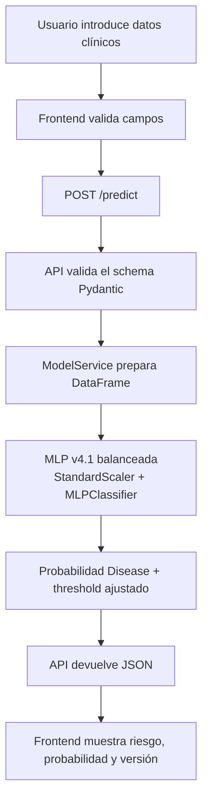

## 8. Flujo De Monitorización

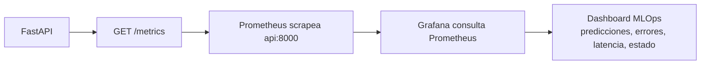

## 9. Estructura De Carpetas

```text
heart-disease-mlops/
├── backend/
│   ├── app/
│   │   ├── main.py
│   │   ├── metrics.py
│   │   ├── model_service.py
│   │   └── schemas.py
│   ├── train_model.py
│   ├── requirements.txt
│   └── Dockerfile
├── data/
│   └── README.md
├── frontend/
│   ├── public/assets/
│   │   ├── logo-icon.png
│   │   └── logo-full.png
│   ├── src/
│   │   ├── App.jsx
│   │   ├── main.jsx
│   │   └── styles.css
│   ├── Dockerfile
│   └── package.json
├── models/
│   ├── heart_model_v1_logistic.joblib
│   ├── heart_model_v2_mlp.joblib
│   ├── heart_model_v3_best.joblib
│   ├── heart_model_v4_mlp_tuned.joblib
│   ├── heart_model_v4_1_mlp_balanced.joblib
│   ├── evaluation_report.json
│   └── model_metadata.json
├── monitoring/
│   ├── prometheus.yml
│   ├── grafana-dashboard.json
│   └── grafana/provisioning/
├── scripts/
│   └── demo_requests.py
├── tests/
│   └── test_api.py
├── docs/
│   ├── images/
│   ├── demo-guide.md
│   ├── grafana-guide.md
│   ├── model-card.md
│   ├── prometheus-queries.md
│   └── taller-base.md
├── .github/
│   └── workflows/ci.yml
├── Makefile
├── docker-compose.yml
├── pytest.ini
├── .gitignore
└── README.md
```

## 10. Dataset

El ZIP base no incluye un archivo de dataset. Por eso el entrenamiento está preparado en este orden:

1. Si existe `data/heart.csv`, se usa ese CSV local.
2. Si se pasa `--data-path`, se usa el CSV indicado.
3. Si no hay CSV local, se descarga `heart-statlog` desde OpenML, que es la fuente usada por el notebook del taller.

Columnas esperadas:

| Campo | Descripción |
|---|---|
| `age` | Edad |
| `sex` | Sexo codificado |
| `chest` | Tipo de dolor torácico |
| `resting_blood_pressure` | Presión arterial en reposo |
| `serum_cholestoral` | Colesterol sérico |
| `fasting_blood_sugar` | Glucosa en ayunas |
| `resting_electrocardiographic_results` | Resultado electrocardiográfico |
| `maximum_heart_rate_achieved` | Frecuencia cardíaca máxima |
| `exercise_induced_angina` | Angina inducida por ejercicio |
| `oldpeak` | Depresión ST |
| `slope` | Pendiente ST |
| `number_of_major_vessels` | Número de vasos principales |
| `thal` | Variable thal |

El script admite alias habituales del dataset UCI/OpenML, como `chest_pain`, `rest_blood_pressure`, `cholesterol`, `max_heart_rate` o `vessels`.

## 11. Modelo De Machine Learning

La versión activa es `v4.1.0`, una red neuronal multicapa entrenada con `MLPClassifier`. Esta versión conserva el requisito académico de usar una red neuronal, pero corrige el comportamiento de v4.0: aquella versión alcanzaba recall perfecto, aunque con demasiados falsos positivos. v4.1 mantiene recall alto y mejora el equilibrio entre precision, F1-score y falsos positivos.

Pipeline activo:

```text
StandardScaler + Balanced Tuned MLPClassifier
```

Archivo generado:

```text
models/heart_model_v4_1_mlp_balanced.joblib
```

Metadata generada:

```text
models/model_metadata.json
```

Reporte de evaluación:

```text
models/evaluation_report.json
```

Ejemplo de metadata:

```json
{
  "model_name": "heart_disease_mlp_balanced",
  "version": "v4.1.0",
  "algorithm": "StandardScaler + Balanced Tuned MLPClassifier",
  "accuracy": 0.7778,
  "precision": 0.6875,
  "recall": 0.9167,
  "f1_score": 0.7857,
  "f2_score": 0.8594,
  "roc_auc": 0.8569,
  "selected_metric": "recall_floor_0.90_then_f1_score",
  "decision_threshold": 0.55,
  "input_features": ["age", "sex", "..."],
  "model_path": "/models/heart_model_v4_1_mlp_balanced.joblib",
  "evaluation_report_path": "models/evaluation_report.json"
}
```

## Reporte De Evaluación

`models/evaluation_report.json` resume la evaluación completa sobre el split de test usado en entrenamiento. Incluye el espacio de búsqueda de hiperparámetros, la mejor configuración encontrada, el resultado de validación cruzada, el threshold elegido, la matriz de confusión, la fuente del dataset y la comparación con v3 y v4.0.

| Métrica | Valor actual |
|---|---:|
| Accuracy | 0.7778 |
| Precision | 0.6875 |
| Recall | 0.9167 |
| F1-score | 0.7857 |
| F2-score | 0.8594 |
| ROC-AUC | 0.8569 |
| Decision threshold | 0.55 |

La matriz de confusión del modelo neuronal v4.1 se genera como imagen en `docs/images/confusion_matrix_mlp_v4_1.png`.

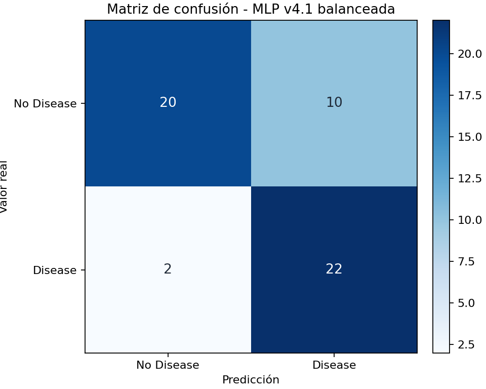

## 12. Modelo Neuronal Final V4.1

`MLPClassifier` implementa una red neuronal multicapa dentro de scikit-learn. En esta versión se entrena como un pipeline reproducible:

- `StandardScaler` normaliza las variables de entrada.
- `MLPClassifier` usa `solver="adam"`.
- `early_stopping=True` detiene el entrenamiento cuando deja de mejorar.
- `StratifiedKFold` mantiene proporciones de clase en validación cruzada.
- `RandomizedSearchCV` busca hiperparámetros sin hacer una búsqueda exhaustiva demasiado lenta.
- El threshold de decisión no queda fijo en `0.5`; se ajusta sobre el set de test.

La mejor configuración encontrada para v4.1 fue:

```json
{
  "hidden_layer_sizes": [16],
  "activation": "tanh",
  "alpha": 0.01,
  "learning_rate_init": 0.001,
  "batch_size": 32,
  "learning_rate": "constant",
  "max_iter": 800
}
```

## Por Qué Recall Mínimo Y F1

En un contexto clínico académico interesa reducir falsos negativos: es preferible que el sistema marque casos dudosos para revisión antes que dejar pasar casos reales de `Disease`. Aun así, v4.0 demostró que maximizar solo `recall` puede generar demasiados falsos positivos.

Por eso v4.1 usa un criterio más equilibrado para threshold tuning:

1. considerar thresholds con `recall >= 0.90`;
2. elegir el de mayor `f1_score`;
3. en empate, elegir mayor `precision`;
4. en empate, elegir mayor `accuracy`;
5. si ningún threshold alcanza `recall >= 0.90`, elegir el de mayor `f2_score`.

El threshold activo es `0.55`. La API lo lee desde `models/model_metadata.json` y lo usa en inferencia:

```text
probability_disease >= decision_threshold -> Disease
probability_disease < decision_threshold  -> No Disease
```

## 13. Versionado Del Modelo

Los modelos se guardan en `models/` con nombre versionado:

| Versión | Archivo | Estado |
|---|---|---|
| v1 | `heart_model_v1_logistic.joblib` | Modelo original del taller conservado. |
| v2 | `heart_model_v2_mlp.joblib` | Modelo MLP conservado como versión anterior. |
| v3 | `heart_model_v3_best.joblib` | Baseline fuerte no neuronal conservado. |
| v4.0 | `heart_model_v4_mlp_tuned.joblib` | Modelo neuronal con recall máximo conservado. |
| v4.1 | `heart_model_v4_1_mlp_balanced.joblib` | Modelo neuronal balanceado activo. |

La API carga el modelo indicado por `models/model_metadata.json`. Si se añade una versión futura, debe actualizarse el metadata para apuntar al nuevo archivo.

## Comparativa V3 Vs V4.0 Vs V4.1

| Versión | Modelo | Accuracy | Precision | Recall | F1 | F2 | ROC-AUC | Comentario |
|---|---|---:|---:|---:|---:|---:|---:|---|
| v3.0.0 | `StandardScaler + LogisticRegression` | 0.8519 | 0.7857 | 0.9167 | 0.8462 | 0.8871 | 0.8958 | Baseline fuerte no neuronal. |
| v4.0.0 | `StandardScaler + Tuned MLPClassifier` | 0.6667 | 0.5714 | 1.0000 | 0.7273 | 0.8696 | 0.8583 | Red neuronal con cero falsos negativos, pero 18 falsos positivos. |
| v4.1.0 | `StandardScaler + Balanced Tuned MLPClassifier` | 0.7778 | 0.6875 | 0.9167 | 0.7857 | 0.8594 | 0.8569 | Modelo neuronal activo, reduce falsos positivos de 18 a 10 manteniendo recall alto. |

La comparación es intencionadamente transparente: v3 sigue siendo un baseline no neuronal fuerte y no se elimina. v4.0 priorizaba al máximo el recall, con 0 falsos negativos pero demasiados falsos positivos. v4.1 mantiene el modelo activo como red neuronal, conserva recall alto y mejora accuracy, precision y F1 respecto a v4.0, reduciendo falsos positivos de 18 a 10.

El detalle completo está en `models/evaluation_report.json`. El modelo v1 del taller se mantiene como referencia histórica en `models/heart_model_v1_logistic.joblib`.

La documentación detallada del modelo está en [`docs/model-card.md`](docs/model-card.md).

## 14. API FastAPI

La API carga el modelo al arrancar y expone predicciones individuales, batch, estado, información del modelo y métricas Prometheus.

Swagger está disponible en:

```text
http://localhost:8000/docs
```

La documentación OpenAPI está organizada por tags:

| Tag | Qué Incluye |
|---|---|
| `System` | `/health` y `/version`, para revisar disponibilidad y versión. |
| `Model` | `/info`, con metadata del modelo cargado. |
| `Prediction` | `/predict` y `/predict/batch`, con ejemplos de entrada y respuesta. |
| `Monitoring` | `/metrics`, pensado para scraping Prometheus. |

Para una demo, lo más útil es abrir Swagger, ejecutar `GET /health`, revisar `GET /info` y probar `POST /predict` con el ejemplo precargado del schema.

### Endpoints

| Método | Ruta | Descripción |
|---|---|---|
| GET | `/health` | Estado de la API y carga del modelo. |
| GET | `/info` | Información del modelo cargado. |
| GET | `/version` | Versión de la aplicación, modelo activo, entorno y timestamp. |
| POST | `/predict` | Predicción individual. |
| POST | `/predict/batch` | Predicción para varios pacientes. |
| GET | `/metrics` | Métricas en formato Prometheus. |
| GET | `/docs` | Swagger UI de FastAPI. |

Ejemplo de respuesta de `/version`:

```json
{
  "app_name": "Heart Disease MLOps API",
  "app_version": "1.0.0",
  "model_version": "v4.1.0",
  "model_name": "heart_disease_mlp_balanced",
  "environment": "local",
  "timestamp": "2026-05-08T10:18:13.703385+00:00"
}
```

### Ejemplo De Petición A `/predict`

```bash
curl -X POST http://localhost:8000/predict \
  -H "Content-Type: application/json" \
  -d '{
    "age": 63,
    "sex": 1,
    "chest": 3,
    "resting_blood_pressure": 145,
    "serum_cholestoral": 233,
    "fasting_blood_sugar": 1,
    "resting_electrocardiographic_results": 0,
    "maximum_heart_rate_achieved": 150,
    "exercise_induced_angina": 0,
    "oldpeak": 2.3,
    "slope": 1,
    "number_of_major_vessels": 0,
    "thal": 6
  }'
```

Respuesta esperada:

```json
{
  "prediction": 1,
  "label": "Disease",
  "probability": 0.82,
  "risk_level": "High",
  "model_version": "v4.1.0",
  "inference_time_ms": 3.4,
  "probabilities": {
    "no_disease": 0.18,
    "disease": 0.82
  },
  "decision_threshold": 0.55
}
```

## 15. Frontend

El frontend está construido con React + Vite y consume `POST /predict` usando:

```text
VITE_API_URL=http://localhost:8000
```

Incluye:

- Interfaz tipo dashboard clínico/técnico, sobria y orientada a producto.
- Cabecera compacta theme-aware con estado de API, modelo activo, accesos técnicos y selector de tema.
- Fila superior de métricas con estado del servicio, modelo activo, última inferencia y resultado actual.
- Grid de dashboard con formulario clínico a la izquierda y resultado/visualizaciones a la derecha.
- Formulario con las 13 variables clínicas agrupadas por secciones.
- Selects para variables categóricas como sexo, dolor torácico, glucosa, angina, pendiente ST y thal.
- Validación básica por rango.
- Panel de resultado con etiqueta, nivel de riesgo, probabilidades, versión del modelo, tiempo de inferencia y fecha local.
- Visualización de probabilidades `Disease` / `No Disease`.
- Indicador de riesgo bajo, medio o alto.
- Resumen visual de los valores de entrada principales.
- Modo claro/oscuro con preferencia guardada en `localStorage`.
- Manejo visual de errores.
- Diseño responsive.

## Diseño De Interfaz

El frontend se ha rediseñado siguiendo principios de [PatternFly Dashboard](https://www.patternfly.org/patterns/dashboard/design-guidelines/). La pantalla evita la estética de landing page y se plantea como una herramienta interna de evaluación clínica/MLOps:

- cards con un propósito claro: estado del servicio, modelo activo, última inferencia y resultado actual;
- métricas y resúmenes visibles en la parte superior para entender el sistema de un vistazo;
- grid de dashboard con formulario clínico a la izquierda y resultado del modelo con más protagonismo a la derecha;
- formulario agrupado por secciones clínicas y campos categóricos con `select`;
- masthead theme-aware: claro y limpio en modo claro, oscuro y sobrio en modo oscuro;
- accesos técnicos discretos en el masthead, sin competir con la tarea principal;
- visualizaciones basadas únicamente en datos reales del formulario, metadata del modelo y respuesta de la API;
- modo claro/oscuro sobrio con preferencia guardada en `localStorage`;
- uso de `prefers-color-scheme: dark` cuando no hay preferencia previa;
- textos funcionales, sin claims comerciales ni lenguaje alarmista.

## Script De Demo Para Métricas

El script `scripts/demo_requests.py` genera llamadas reales a `POST /predict` para poblar Prometheus y Grafana antes de una presentación.

Uso básico:

```bash
python scripts/demo_requests.py
```

Uso con parámetros:

```bash
python scripts/demo_requests.py --api-url http://localhost:8000 --requests 25
```

El resumen por consola incluye:

- número de peticiones realizadas;
- predicciones `Disease` y `No Disease`;
- errores agrupados, si los hay;
- tiempo medio aproximado.

## 16. Prometheus

Prometheus se configura en `monitoring/prometheus.yml` y recoge métricas desde:

```text
http://api:8000/metrics
```

El job se llama `heart-api`, usa `scrape_interval: 10s` y apunta al target Docker `api:8000`.

### Cómo Leer `/metrics`

El endpoint http://localhost:8000/metrics devuelve texto plano en formato Prometheus. No está pensado como dashboard visual para humanos: su función es que Prometheus lo scrapee periódicamente y almacene series temporales.

Para verlo:

```bash
curl -fsS http://localhost:8000/metrics
```

Métricas principales:

| Métrica | Descripción |
|---|---|
| `api_requests_total` | Requests HTTP por método, endpoint y código. |
| `api_request_duration_seconds` | Latencia HTTP. |
| `api_request_errors_total` | Errores HTTP 5xx. |
| `heart_predictions_total` | Total de predicciones. |
| `heart_prediction_errors_total` | Errores durante inferencia. |
| `heart_prediction_duration_seconds` | Latencia de inferencia. |
| `heart_predictions_by_class_total` | Predicciones por clase y nivel de riesgo. |
| `heart_model_info` | Metadata del modelo cargado. |
| `heart_api_up` | Estado de salud de la API. |

### Cómo Ver Métricas En Prometheus

1. Levanta la pila:

```bash
docker compose up --build
```

2. Genera tráfico real:

```bash
python scripts/demo_requests.py --requests 25 --sleep 0.05
```

3. Abre targets:

```text
http://localhost:9090/targets
```

4. Comprueba que `heart-api` está `UP`.
5. Abre el explorador:

```text
http://localhost:9090/graph
```

Queries útiles:

| Query | Significado |
|---|---|
| `heart_api_up` | Estado de la API: `1` operativa, `0` no disponible. |
| `rate(api_requests_total[5m])` | Tasa de requests por segundo en los últimos 5 minutos. |
| `heart_predictions_total` | Total acumulado de predicciones por endpoint. |
| `sum by (label) (heart_predictions_by_class_total)` | Distribución de predicciones por clase. |
| `histogram_quantile(0.95, sum(rate(heart_prediction_duration_seconds_bucket[5m])) by (le, endpoint))` | Percentil 95 de latencia de inferencia. |
| `sum by (endpoint) (rate(api_request_duration_seconds_sum[5m])) / sum by (endpoint) (rate(api_request_duration_seconds_count[5m]))` | Latencia HTTP media por endpoint. |
| `api_request_errors_total` | Errores HTTP 5xx acumulados. |

Guía ampliada: [`docs/prometheus-queries.md`](docs/prometheus-queries.md).

## 17. Grafana

Grafana se levanta en:

```text
http://localhost:3001/login
```

Credenciales por defecto:

```text
usuario: admin
password: change-me-local-demo
```

Estas credenciales son únicamente para demo local. Antes de publicar un despliegue real, define `GRAFANA_ADMIN_USER` y `GRAFANA_ADMIN_PASSWORD` en un `.env` local que no se suba al repositorio.

El dashboard se provisiona automáticamente desde:

```text
monitoring/grafana-dashboard.json
```

Nombre del dashboard:

```text
Heart Disease MLOps Observability
```

Paneles incluidos y organizados por filas:

| Fila | Paneles |
|---|---|
| Overview | API status, Total predictions, Request rate, Errors |
| Predictions | Predictions by class, Predictions by risk level |
| Latency | Prediction latency p95, HTTP latency average |
| Errors | API errors by endpoint, Prediction errors by endpoint |
| Model | Model info |

Pasos recomendados:

1. Levanta Docker Compose.
2. Genera tráfico con `python scripts/demo_requests.py --requests 25 --sleep 0.05`.
3. Entra en Grafana con las credenciales de demo local.
4. Abre la carpeta `MLOps`.
5. Abre `Heart Disease MLOps Observability`.
6. Comprueba que el rango temporal está en `Last 1 hour` y el refresh en `10s`.

Guía ampliada: [`docs/grafana-guide.md`](docs/grafana-guide.md).

## 18. Cómo Ejecutar El Proyecto

Requisito: Docker Desktop o Docker Engine con Docker Compose.

```bash
docker compose up --build
```

Después abre:

| Servicio | URL |
|---|---|
| Frontend | http://localhost:3000 |
| Swagger | http://localhost:8000/docs |
| Métricas | http://localhost:8000/metrics |
| Prometheus | http://localhost:9090 |
| Grafana | http://localhost:3001 |

Para detener:

```bash
docker compose down
```

## Comandos Útiles

El `Makefile` resume los comandos habituales del proyecto:

| Comando | Acción |
|---|---|
| `make up` | Levanta la aplicación con `docker compose up --build`. |
| `make down` | Detiene los servicios con `docker compose down`. |
| `make test` | Ejecuta `python3 -m pytest`. |
| `make train` | Reentrena el modelo con `python backend/train_model.py`. |
| `make frontend-build` | Instala dependencias del frontend y ejecuta `npm run build`. |
| `make demo` | Ejecuta `python scripts/demo_requests.py`. |

## 19. Cómo Entrenar El Modelo

Con entorno local:

```bash
python -m venv .venv
source .venv/bin/activate
pip install -r backend/requirements.txt
python backend/train_model.py
```

Con CSV propio:

```bash
python backend/train_model.py --data-path data/heart.csv
```

Salida esperada:

```text
models/heart_model_v4_1_mlp_balanced.joblib
models/model_metadata.json
models/evaluation_report.json
docs/images/confusion_matrix_mlp_v4_1.png
```

## 20. Cómo Ejecutar Los Tests

```bash
pip install -r backend/requirements.txt
pytest
```

Los tests básicos están en `tests/test_api.py` y validan:

- `GET /health`
- `GET /info`
- `GET /version`
- `POST /predict`
- `GET /metrics`

GitHub Actions ejecuta estos tests automáticamente en Pull Requests y pushes a `main`.

## 21. Capturas Del Proyecto

Las capturas se guardan en `docs/images/`. No se incluyen imágenes falsas: deben generarse con la aplicación real levantada mediante Docker Compose.

| Captura | Ruta |
|---|---|
| Logo icono | `docs/images/logo-icon.png` |
| Logo completo | `docs/images/logo-full.png` |
| Frontend modo claro | `docs/images/frontend-light.png` |
| Frontend modo oscuro | `docs/images/frontend-dark.png` |
| Swagger | `docs/images/swagger.png` |
| Prometheus targets | `docs/images/prometheus-targets.png` |
| Prometheus graph | `docs/images/prometheus-graph.png` |
| Grafana dashboard | `docs/images/grafana-dashboard.png` |
| Matriz de confusión v3 | `docs/images/confusion_matrix.png` |
| Matriz de confusión MLP v4 | `docs/images/confusion_matrix_mlp_v4.png` |
| Matriz de confusión MLP v4.1 | `docs/images/confusion_matrix_mlp_v4_1.png` |

### Frontend Claro

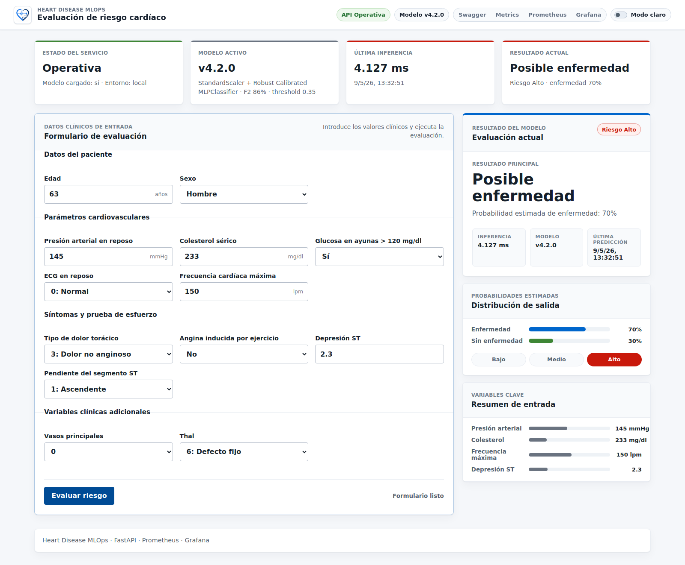

### Frontend Oscuro

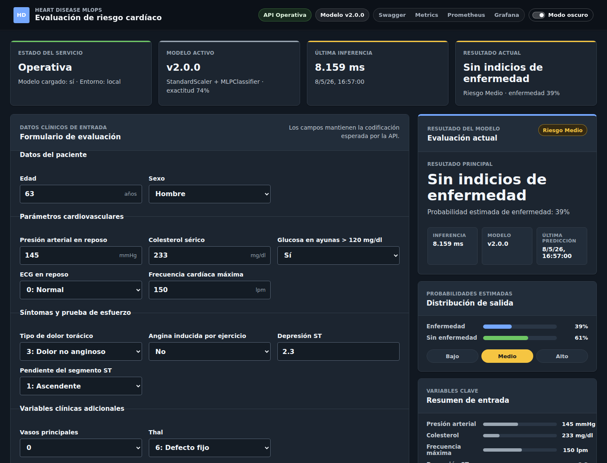

### Swagger

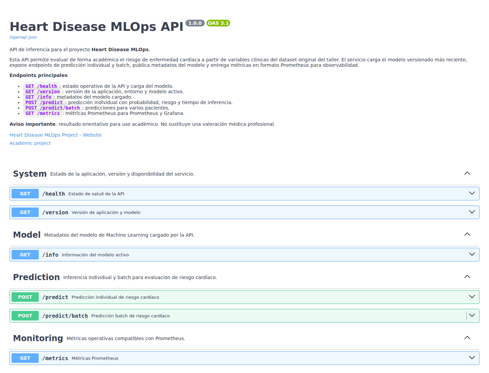

### Prometheus Targets

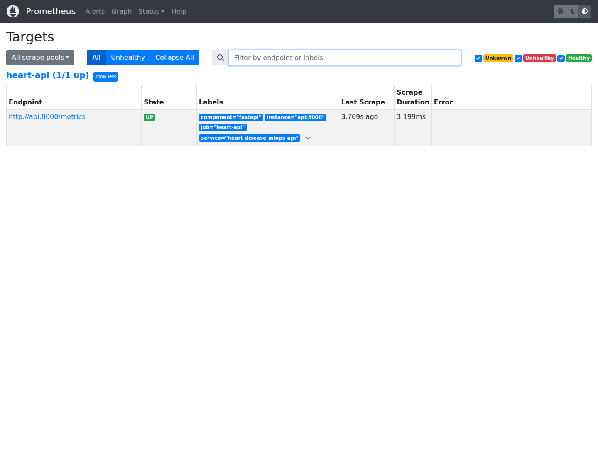

### Prometheus Graph

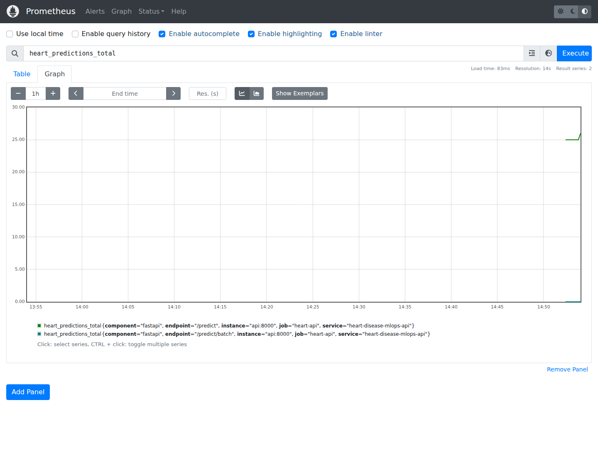

### Grafana

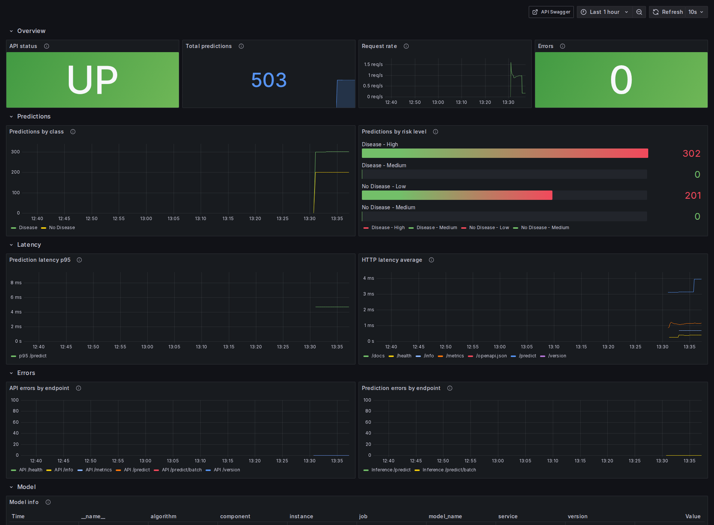

### Matriz De Confusión V3

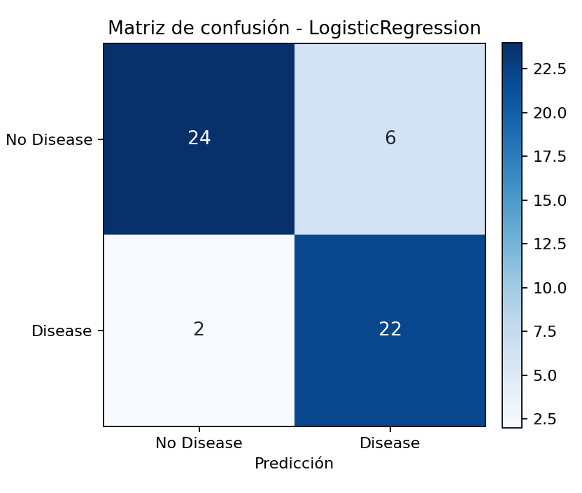

### Matriz De Confusión MLP V4

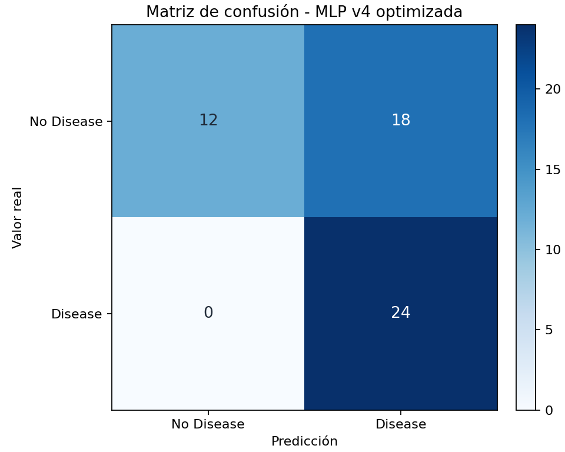

### Matriz De Confusión MLP V4.1


## 22. Posibles Problemas Y Soluciones

| Problema | Solución |
|---|---|
| `Model not loaded` | Verifica que existe `models/model_metadata.json` y que `model_path` apunta a un `.joblib` real. |
| Error al entrenar por dataset | Añade `data/heart.csv` o revisa la conexión a OpenML. |
| Puerto ocupado | Cambia el puerto en `docker-compose.yml` o detén el proceso que lo usa. |
| El frontend no llama a la API | Revisa `VITE_API_URL` y CORS en `CORS_ORIGINS`. |
| Prometheus no ve la API | Comprueba que el servicio `api` esté healthy y que `/metrics` responda. |
| Grafana no muestra datos | Genera tráfico con el frontend o con `curl /predict`. |

## Preparación Antes De Publicar El Repo

Antes de hacer público el repositorio, revisa:

- que no exista un `.env` real versionado;
- que no haya tokens, claves privadas, certificados ni credenciales reales;
- que `node_modules/`, `.venv/`, `__pycache__/`, logs y archivos temporales no estén en Git;
- que `.env.example` solo contenga valores de demo local;
- que las credenciales de Grafana se configuren por variables de entorno si se despliega fuera de local;
- que las capturas añadidas en `docs/images/` no muestren datos privados.

## 23. Mejoras Futuras

- Añadir validación clínica más detallada por variable.
- Calibrar probabilidades del MLP y evaluar thresholds en validación cruzada anidada.
- Ampliar CI/CD con publicación de imágenes Docker y release automática.
- Persistir métricas y logs con almacenamiento externo.
- Añadir autenticación para el frontend y la API.
- Registrar experimentos y comparativas en una herramienta dedicada como MLflow.
- Añadir alertas en Grafana para estado API, errores y latencia p95.

## 24. Conclusión

Este repositorio convierte el taller inicial en una aplicación MLOps completa: API productiva, modelo neuronal v4.1 versionado, threshold documentado, interfaz visual, métricas, monitorización y despliegue reproducible con Docker Compose. También conserva el modelo original del taller, el baseline v3 y la red neuronal v4.0, documentando claramente que el ZIP no incluía dataset CSV y dejando el proyecto preparado para incorporar datos locales en `data/heart.csv`.
