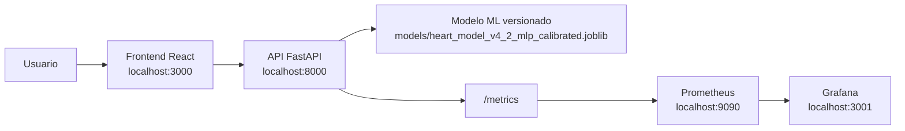
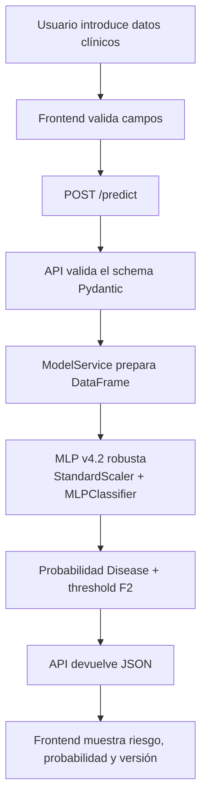
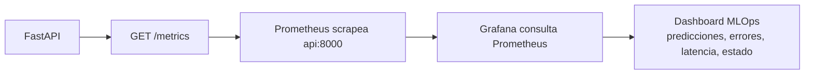
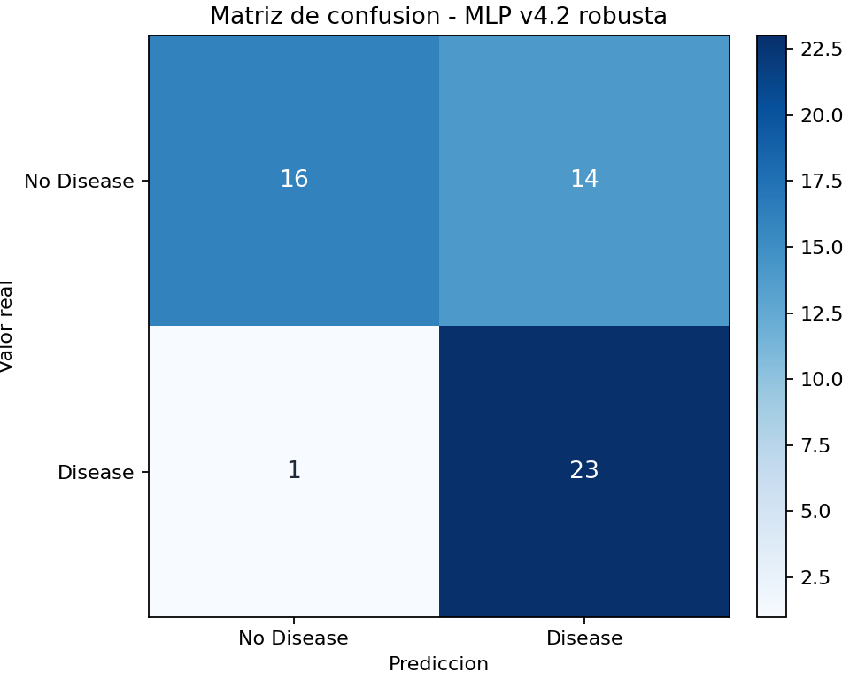
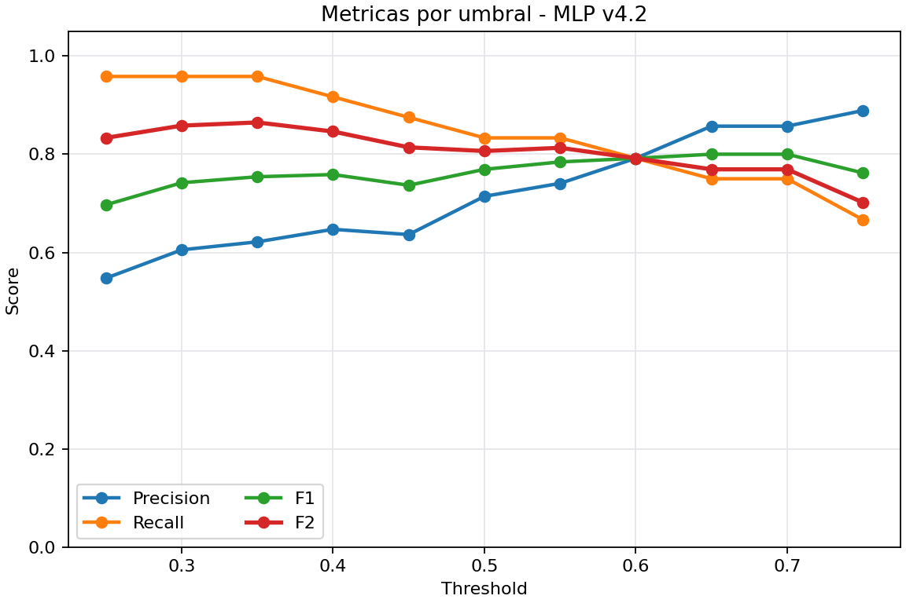
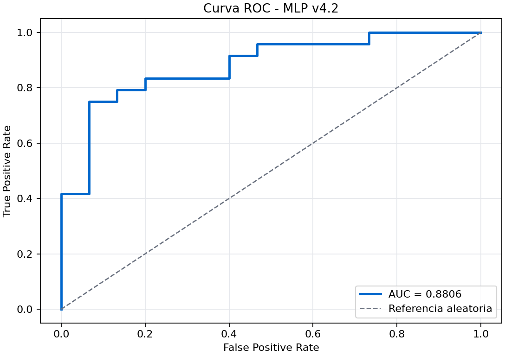
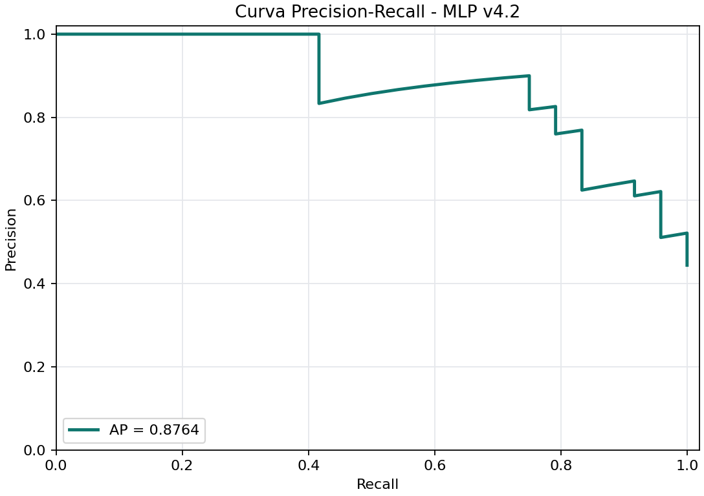
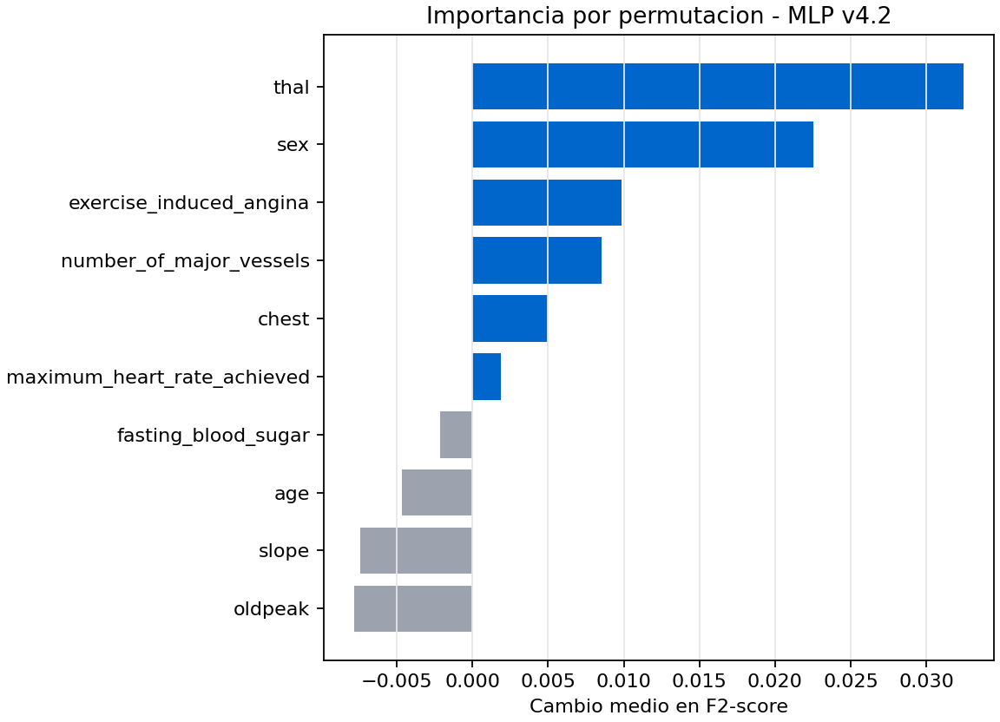
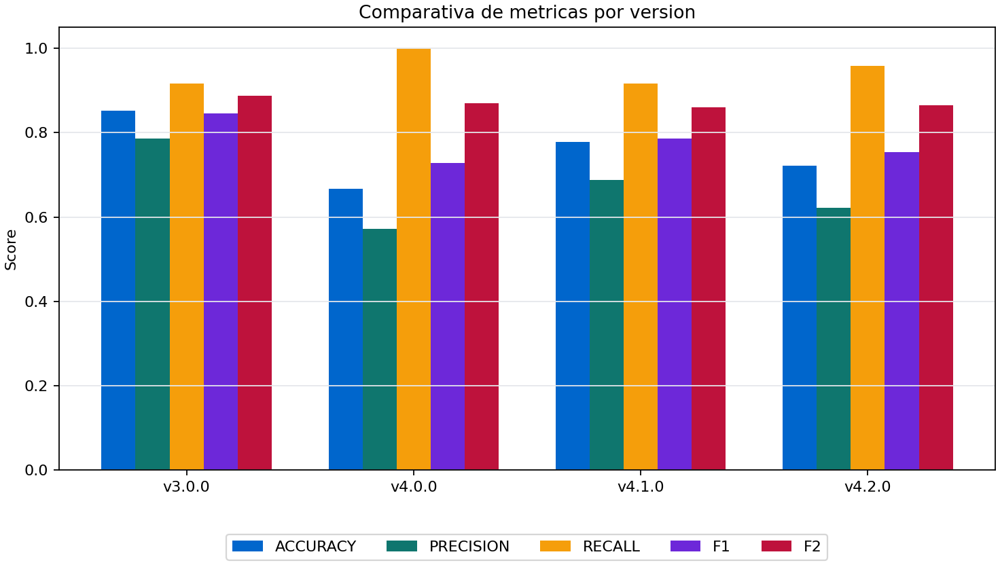

<p align="center">
  
</p>

# Heart Disease MLOps


Aplicación para estimar el riesgo de enfermedad cardíaca a partir de datos clínicos. Incluye una API, una interfaz web, un modelo de red neuronal ya entrenado, métricas para revisar su funcionamiento, ejecución con Docker y documentación para entender y probar el proyecto.

## Resumen

Heart Disease MLOps reúne una interfaz web, una API y un modelo de red neuronal para estimar el riesgo de enfermedad cardíaca. También incluye métricas, paneles de monitorización, ejecución con Docker y pruebas automáticas. El modelo activo es la versión `v4.2.0`, basado en `StandardScaler + Robust Calibrated MLPClassifier`.

### Modo claro


### Modo oscuro


La interfaz permite introducir los datos clínicos del paciente y obtener una predicción del modelo. También muestra el estado de la API, la versión del modelo, el resultado, el nivel de riesgo, las probabilidades y el tiempo de respuesta.

## 1. Qué Hace El Proyecto

Este proyecto permite estimar el riesgo de enfermedad cardíaca a partir de datos clínicos. Para ello usa un modelo de Machine Learning conectado a una API y a una interfaz web. Además, incluye métricas para revisar el funcionamiento de la aplicación en Prometheus y Grafana.

Servicios principales:

| Servicio | URL |
|---|---|
| Frontend React | http://localhost:3000 |
| API FastAPI | http://localhost:8000 |
| Swagger | http://localhost:8000/docs |
| Métricas | http://localhost:8000/metrics |
| Prometheus | http://localhost:9090 |
| Grafana | http://localhost:3001 |

## Demo Rápida Profesional

1. Levanta todos los servicios:

```bash
docker compose up --build
```

2. Abre el frontend en http://localhost:3000.
3. Introduce los datos del paciente y lanza una predicción.
4. Genera tráfico adicional para métricas:

```bash
python scripts/demo_requests.py --requests 500 --sleep 0.01
```

5. Abre Swagger en http://localhost:8000/docs y prueba `POST /predict`.
6. Revisa Prometheus en http://localhost:9090/targets y confirma que `heart-api` está `UP`.
7. Abre Grafana en http://localhost:3001/login y entra al dashboard `Heart Disease MLOps Observability`.

Guía completa: [`docs/demo-guide.md`](docs/demo-guide.md).

## 2. Objetivo

El objetivo del proyecto es crear una aplicación completa y fácil de probar para estimar el riesgo de enfermedad cardíaca.

Para ello se incluye:

- una API documentada con FastAPI;
- un modelo de red neuronal `MLPClassifier` ya entrenado y versionado;
- una interfaz web para introducir datos y ver resultados;
- métricas para Prometheus;
- un dashboard en Grafana;
- ejecución con Docker Compose;
- tests básicos con `pytest`;
- validación automática con GitHub Actions.

## 3. Problema que resuelve

El proyecto permite usar un modelo de predicción de enfermedad cardíaca de forma más completa y sencilla.

No se limita solo a ejecutar el modelo desde una API. También añade una interfaz web para introducir los datos del paciente, una forma clara de ver el resultado, métricas para revisar el funcionamiento del sistema y documentación para entender cómo está organizado.

En resumen, permite probar el modelo, ver la predicción y comprobar cómo se comporta la aplicación durante su uso.

## 4. Tecnologías Usadas

| Área | Tecnología |
|---|---|
| API | FastAPI, Pydantic, Uvicorn |
| ML | scikit-learn, `StandardScaler`, `MLPClassifier`, `RandomizedSearchCV`, `RepeatedStratifiedKFold`, joblib |
| Frontend | React, Vite, CSS responsive |
| Métricas | prometheus-client |
| Monitorización | Prometheus, Grafana |
| Contenedores | Docker, Docker Compose |
| Tests | pytest, FastAPI TestClient |
| CI/CD | GitHub Actions |

## Validación automática con GitHub Actions

El proyecto incluye una configuración de GitHub Actions para comprobar que todo sigue funcionando después de cada cambio.

Cada vez que se suben cambios a `main` o se abre un Pull Request, se ejecutan estas validaciones:

- en el backend, se instalan las dependencias y se lanzan los tests con `pytest`;
- en el frontend, se instalan las dependencias y se comprueba que la aplicación puede compilar correctamente.

## Calidad Técnica

El proyecto incluye varias piezas pensadas para que la entrega sea evaluable y mantenible:

| Área | Implementación |
|---|---|
| CI | GitHub Actions valida backend y frontend automáticamente. |
| Tests | `pytest` cubre salud, información, versión, predicción y métricas. |
| Docker Compose | Levanta API, frontend, Prometheus y Grafana con un solo comando. |
| Versionado de modelo | Los artefactos se conservan en `models/` y se cargan desde metadata. |
| Métricas | `/metrics` expone requests, errores, latencia e inferencias. |
| Model Card | `docs/model-card.md` documenta uso previsto, límites y riesgos. |
| Evaluación | `models/evaluation_report.json` registra búsqueda de hiperparámetros, validación cruzada repetida, calibración evaluada, threshold, métricas finales, curvas, matriz de confusión y comparación entre v3, v4.0, v4.1 y v4.2. |
| Logging | La API registra carga de modelo, versión, peticiones, inferencias y errores de forma clara. |

## 5. Arquitectura General



El flujo principal es sencillo, el usuario introduce los datos en la interfaz web, el frontend los envía a la API y la API consulta el modelo para devolver la predicción.

Además, la API publica métricas en `/metrics`. Prometheus recoge esas métricas y Grafana las muestra en un dashboard para poder revisar el estado, los errores, las predicciones y los tiempos de respuesta.

## 6. Flujo De Predicción



## 7. Flujo De Monitorización



## 8. Estructura De Carpetas

```text
heart-disease-mlops/
├── backend/
│   ├── app/
│   │   ├── main.py
│   │   ├── metrics.py
│   │   ├── model_service.py
│   │   └── schemas.py
│   ├── train_model.py
│   ├── requirements.txt
│   └── Dockerfile
├── frontend/
│   ├── public/assets/
│   │   ├── logo-icon.png
│   │   └── logo-full.png
│   ├── src/
│   │   ├── App.jsx
│   │   ├── main.jsx
│   │   └── styles.css
│   ├── Dockerfile
│   └── package.json
├── models/
│   ├── heart_model_v1_logistic.joblib
│   ├── heart_model_v2_mlp.joblib
│   ├── heart_model_v3_best.joblib
│   ├── heart_model_v4_mlp_tuned.joblib
│   ├── heart_model_v4_1_mlp_balanced.joblib
│   ├── heart_model_v4_2_mlp_calibrated.joblib
│   ├── evaluation_report.json
│   └── model_metadata.json
├── monitoring/
│   ├── prometheus.yml
│   ├── grafana-dashboard.json
│   └── grafana/provisioning/
├── scripts/
│   └── demo_requests.py
├── tests/
│   └── test_api.py
├── docs/
│   ├── images/
│   ├── demo-guide.md
│   ├── grafana-guide.md
│   ├── model-card.md
│   └── prometheus-queries.md
├── .github/
│   └── workflows/ci.yml
├── Makefile
├── docker-compose.yml
├── pytest.ini
├── .gitignore
└── README.md
```

## 9. Dataset

El modelo utiliza el dataset `heart-statlog` de OpenML, un conjunto de datos sobre enfermedad cardíaca.

El entrenamiento está preparado para usar los datos en este orden:

1. si existe `data/heart.csv`, se usa ese archivo local;
2. si se indica un archivo con `--data-path`, se usa ese CSV;
3. si no hay archivo local, se descarga automáticamente `heart-statlog` desde OpenML.

El dataset contiene 270 registros de pacientes y 13 variables clínicas. Para este proyecto académico es suficiente, aunque en un caso real sería necesario usar un dataset más grande, actualizado y validado.

Columnas esperadas:

| Campo | Descripción |
|---|---|
| `age` | Edad |
| `sex` | Sexo codificado |
| `chest` | Tipo de dolor torácico |
| `resting_blood_pressure` | Presión arterial en reposo |
| `serum_cholestoral` | Colesterol sérico |
| `fasting_blood_sugar` | Glucosa en ayunas |
| `resting_electrocardiographic_results` | Resultado electrocardiográfico |
| `maximum_heart_rate_achieved` | Frecuencia cardíaca máxima |
| `exercise_induced_angina` | Angina inducida por ejercicio |
| `oldpeak` | Depresión ST |
| `slope` | Pendiente ST |
| `number_of_major_vessels` | Número de vasos principales |
| `thal` | Variable thal |

El script también acepta algunos nombres alternativos de columnas, como `chest_pain`, `cholesterol`, `max_heart_rate` o `vessels`, para facilitar el uso de datasets con nombres ligeramente distintos.

## 10. Modelo de Machine Learning

La versión activa del modelo es `v4.2.0`.

El modelo usado es una red neuronal multicapa creada con `MLPClassifier` de scikit-learn. Antes de entrenar el modelo, los datos se normalizan con `StandardScaler`.

Pipeline activo:

```text
StandardScaler + MLPClassifier
```

El modelo final se guarda en:

```text
models/heart_model_v4_2_mlp_calibrated.joblib
```

Además del modelo, se guardan dos archivos importantes:

```text
models/model_metadata.json
models/evaluation_report.json
```

`model_metadata.json` contiene la información principal del modelo, como el nombre, la versión, las métricas y el archivo que debe cargar la API.

Resumen de métricas del modelo activo:

| Métrica | Valor |
|---|---:|
| Accuracy | 0.7222 |
| Precision | 0.6216 |
| Recall | 0.9583 |
| F1-score | 0.7541 |
| F2-score | 0.8647 |
| ROC-AUC | 0.8806 |

La métrica principal elegida es `F2-score`, porque da más importancia al `recall`. En este proyecto interesa detectar la mayoría de posibles casos `Disease`, aunque eso pueda generar más falsos positivos.

El threshold de decisión usado por la API es:

```text
0.35
```

Esto significa:

```text
probabilidad de Disease >= 0.35 -> Disease
probabilidad de Disease < 0.35  -> No Disease
```

## Reporte De Evaluación

`models/evaluation_report.json` resume la evaluación completa sobre el split de test usado en entrenamiento. Incluye el espacio de búsqueda, la mejor configuración, resumen de validación cruzada, comparación calibrada/no calibrada, threshold elegido, matriz de confusión, curvas ROC y Precision-Recall, importancia por permutación, fuente del dataset y comparación entre v3.0, v4.0, v4.1 y v4.2.

| Métrica | Valor actual |
|---|---:|
| Accuracy | 0.7222 |
| Precision | 0.6216 |
| Recall | 0.9583 |
| F1-score | 0.7541 |
| F2-score | 0.8647 |
| ROC-AUC | 0.8806 |
| Average precision | 0.8764 |
| Brier score | 0.1483 |
| Decision threshold | 0.35 |

La matriz de confusión también se guarda como imagen en `docs/images/confusion_matrix_mlp_v4_2.png`. Esta imagen ayuda a ver de forma rápida cuántos casos acertó el modelo y cuántos errores tuvo.

## 11. Modelo neuronal final v4.2

El modelo final es una red neuronal multicapa creada con `MLPClassifier` de scikit-learn.

Antes de pasar los datos al modelo, se aplica `StandardScaler` para normalizar las 13 variables clínicas. Esto ayuda a que todas las variables tengan una escala similar durante el entrenamiento.

Para elegir la mejor versión del modelo se probaron varias configuraciones con `RandomizedSearchCV`. También se usó validación cruzada repetida para obtener una evaluación más estable.

La métrica principal usada fue `F2-score`, porque da más importancia al `recall`. En este proyecto interesa reducir los falsos negativos, es decir, evitar que un caso con posible enfermedad sea marcado como `No Disease`.

El modelo no usa siempre el threshold típico de `0.5`. En su lugar, se probaron varios umbrales y se eligió `0.35`, que fue el que mejor funcionó según el objetivo del proyecto.

También se evaluó una calibración de probabilidades con `CalibratedClassifierCV`, pero no se aplicó al modelo final porque no mejoraba el resultado elegido.

La mejor configuración encontrada para v4.2 fue:

```json
{
  "hidden_layer_sizes": [64, 32],
  "activation": "tanh",
  "alpha": 0.0001,
  "learning_rate_init": 0.0005,
  "batch_size": 64,
  "learning_rate": "adaptive",
  "max_iter": 1500
}
```

## Validación Cruzada, Calibración Y Threshold

En este proyecto interesa reducir los falsos negativos. Es decir, se busca evitar que un caso con posible enfermedad sea clasificado como `No Disease`.

Al mismo tiempo, tampoco conviene marcar demasiados casos sanos como `Disease`. Por eso no se usa solo `recall`, sino `F2-score`, una métrica que da más importancia al `recall`, pero sigue teniendo en cuenta la `precision`.

De esta forma, el modelo intenta detectar la mayoría de casos de riesgo sin ignorar completamente los falsos positivos.

El threshold activo es `0.35`. La API lo lee desde `models/model_metadata.json` y lo usa en inferencia:

```text
probability_disease >= decision_threshold -> Disease
probability_disease < decision_threshold  -> No Disease
```

La calibración se documenta de forma explícita:

| Variante | Accuracy | Precision | Recall | F1 | F2 | ROC-AUC | Brier | Decisión |
|---|---:|---:|---:|---:|---:|---:|---:|---|
| Sin calibrar | 0.7222 | 0.6216 | 0.9583 | 0.7541 | 0.8647 | 0.8806 | 0.1483 | Activa |
| Sigmoid calibrada | 0.7963 | 0.7241 | 0.8750 | 0.7925 | 0.8400 | 0.8597 | 0.1540 | Evaluada, no aplicada |

La versión calibrada mejora algunas métricas, como `accuracy`, `precision` y `F1`.

Sin embargo, baja otras métricas importantes para este proyecto, como `recall`, `F2-score` y `ROC-AUC`.

Como el objetivo principal es detectar el mayor número posible de casos `Disease`, se mantiene como modelo activo la versión sin calibrar. Esta decisión queda documentada en el reporte de evaluación.

## Métricas del modelo

Para interpretar el modelo se usan las siguientes cantidades:

- `TP`: verdadero positivo, paciente con `Disease` predicho como `Disease`.
- `TN`: verdadero negativo, paciente sin enfermedad predicho como `No Disease`.
- `FP`: falso positivo, paciente sin enfermedad marcado como `Disease`.
- `FN`: falso negativo, paciente con enfermedad marcado como `No Disease`.

| Métrica | Fórmula | Qué responde |
|---|---|---|
| Accuracy | $Accuracy = \frac{TP + TN}{TP + TN + FP + FN}$ | Mide aciertos globales. |
| Precision | $Precision = \frac{TP}{TP + FP}$ | De los casos marcados como enfermedad, cuántos realmente lo eran. |
| Recall | $Recall = \frac{TP}{TP + FN}$ | De los enfermos reales, cuántos detectó el modelo. |
| F1-score | $F1 = 2 \cdot \frac{Precision \cdot Recall}{Precision + Recall}$ | Equilibra precision y recall. |
| F2-score | $F2 = 5 \cdot \frac{Precision \cdot Recall}{4 \cdot Precision + Recall}$ | Da más peso al recall que a precision. |

Regla de decisión:

$$
\hat{y} =
\begin{cases}
Disease & \text{si } P(Disease) \geq threshold \\
No\ Disease & \text{si } P(Disease) < threshold
\end{cases}
$$

Lectura sencilla:

- `Precision`: de todos los casos que el modelo marcó como `Disease`, cuántos realmente eran `Disease`.
- `Recall`: de todos los casos reales de `Disease`, cuántos consiguió detectar el modelo.
- `F2-score`: combina `precision` y `recall`, pero da más importancia al `recall`.
- En este proyecto se prioriza detectar la mayoría de posibles casos `Disease`, aunque eso pueda aumentar los falsos positivos.

## Por qué no usamos solo accuracy

No se usa solo `accuracy` porque puede dar una visión incompleta del modelo.

En este proyecto es importante fijarse también en métricas como `recall` y `F2-score`, ya que interesa detectar la mayoría de posibles casos `Disease`.

Un falso negativo significa que el modelo clasifica como `No Disease` un caso que realmente era `Disease`. Por eso se prefiere aceptar algunos falsos positivos antes que dejar pasar demasiados casos de riesgo.

La versión `v4.2.0` no tiene la mejor `accuracy`, pero mantiene el modelo final como red neuronal y consigue un buen equilibrio para el objetivo del proyecto.

## Imágenes técnicas del modelo

El entrenamiento genera varias imágenes para entender mejor el comportamiento del modelo.

La matriz de confusión resume los aciertos y errores de la versión `v4.2.0`:

- `TN = 16`: casos `No Disease` clasificados correctamente;
- `FP = 14`: casos `No Disease` marcados como `Disease`;
- `FN = 1`: casos `Disease` clasificados como `No Disease`;
- `TP = 23`: casos `Disease` clasificados correctamente.

Esta matriz ayuda a ver de forma sencilla qué tipo de errores comete el modelo.



El gráfico de threshold muestra cómo cambian precision, recall, F1 y F2 al mover el umbral de decisión. El umbral `0.35` se eligió porque maximiza F2-score en el set de test.



La curva ROC muestra la capacidad del modelo para separar clases a distintos umbrales. En v4.2 el ROC-AUC es `0.8806`.



La curva Precision-Recall es especialmente útil cuando importa detectar positivos y entender el balance entre sensibilidad y falsos positivos.



La importancia por permutación estima cuánto cae F2-score al alterar una variable. Es una aproximación explicativa del modelo, no una afirmación de causalidad clínica.



## 13. Versionado Del Modelo

Los modelos se guardan en `models/` con nombre versionado:

| Versión | Archivo | Estado |
|---|---|---|
| v1 | `heart_model_v1_logistic.joblib` | Modelo original del taller conservado. |
| v2 | `heart_model_v2_mlp.joblib` | Modelo MLP conservado como versión anterior. |
| v3 | `heart_model_v3_best.joblib` | Baseline fuerte no neuronal conservado. |
| v4.0 | `heart_model_v4_mlp_tuned.joblib` | Modelo neuronal con recall máximo conservado. |
| v4.1 | `heart_model_v4_1_mlp_balanced.joblib` | Modelo neuronal balanceado conservado. |
| v4.2 | `heart_model_v4_2_mlp_calibrated.joblib` | Modelo neuronal robusto activo. |

La API carga el modelo indicado por `models/model_metadata.json`. Si se añade una versión futura, debe actualizarse el metadata para apuntar al nuevo archivo.

## Comparativa V3 Vs V4.0 Vs V4.1 Vs V4.2

| Versión | Modelo | Accuracy | Precision | Recall | F1 | F2 | ROC-AUC | Threshold | Comentario |
|---|---|---:|---:|---:|---:|---:|---:|---:|---|
| v3.0.0 | `StandardScaler + LogisticRegression` | 0.8519 | 0.7857 | 0.9167 | 0.8462 | 0.8871 | 0.8958 | n/a | Baseline fuerte no neuronal. |
| v4.0.0 | `StandardScaler + Tuned MLPClassifier` | 0.6667 | 0.5714 | 1.0000 | 0.7273 | 0.8696 | 0.8583 | 0.35 | Red neuronal con cero falsos negativos, pero 18 falsos positivos. |
| v4.1.0 | `StandardScaler + Balanced Tuned MLPClassifier` | 0.7778 | 0.6875 | 0.9167 | 0.7857 | 0.8594 | 0.8569 | 0.55 | Red neuronal más equilibrada, con 10 falsos positivos y 2 falsos negativos. |
| v4.2.0 | `StandardScaler + Robust Calibrated MLPClassifier` | 0.7222 | 0.6216 | 0.9583 | 0.7541 | 0.8647 | 0.8806 | 0.35 | Modelo neuronal activo; mejora recall, F2 y ROC-AUC frente a v4.1, reduce falsos negativos y acepta más falsos positivos como trade-off. |

La comparación se muestra de forma clara para no ocultar los resultados.

La versión `v3` sigue siendo un modelo clásico fuerte, aunque no es una red neuronal. La versión `v4.1` obtiene mejores valores en algunas métricas, como `accuracy`, `precision` y `F1`. Aun así, se usa `v4.2` como modelo final porque mantiene el requisito de usar una red neuronal MLP y mejora métricas importantes para este proyecto, como `recall`, `F2-score` y `ROC-AUC`. También se documenta el punto débil de esta decisión: la versión `v4.2` acepta más falsos positivos.



El detalle completo está en `models/evaluation_report.json`. El modelo v1 del taller se mantiene como referencia histórica en `models/heart_model_v1_logistic.joblib`.

La documentación detallada del modelo está en [`docs/model-card.md`](docs/model-card.md).

## 14. API FastAPI

La API carga el modelo al arrancar y expone predicciones individuales, batch, estado, información del modelo y métricas Prometheus.

Swagger está disponible en:

```text
http://localhost:8000/docs
```

La documentación OpenAPI está organizada por tags:

| Tag | Qué Incluye |
|---|---|
| `System` | `/health` y `/version`, para revisar disponibilidad y versión. |
| `Model` | `/info`, con metadata del modelo cargado. |
| `Prediction` | `/predict` y `/predict/batch`, con ejemplos de entrada y respuesta. |
| `Monitoring` | `/metrics`, pensado para scraping Prometheus. |

Para una demo, lo más útil es abrir Swagger, ejecutar `GET /health`, revisar `GET /info` y probar `POST /predict` con el ejemplo precargado del schema.

### Endpoints

| Método | Ruta | Descripción |
|---|---|---|
| GET | `/health` | Estado de la API y carga del modelo. |
| GET | `/info` | Información del modelo cargado. |
| GET | `/version` | Versión de la aplicación, modelo activo, entorno y timestamp. |
| POST | `/predict` | Predicción individual. |
| POST | `/predict/batch` | Predicción para varios pacientes. |
| GET | `/metrics` | Métricas en formato Prometheus. |
| GET | `/docs` | Swagger UI de FastAPI. |

Ejemplo de respuesta de `/version`:

```json
{
  "app_name": "Heart Disease MLOps API",
  "app_version": "1.0.0",
  "model_version": "v4.2.0",
  "model_name": "heart_disease_mlp_calibrated",
  "environment": "local",
  "timestamp": "2026-05-08T10:18:13.703385+00:00"
}
```

### Ejemplo De Petición A `/predict`

```bash
curl -X POST http://localhost:8000/predict \
  -H "Content-Type: application/json" \
  -d '{
    "age": 63,
    "sex": 1,
    "chest": 3,
    "resting_blood_pressure": 145,
    "serum_cholestoral": 233,
    "fasting_blood_sugar": 1,
    "resting_electrocardiographic_results": 0,
    "maximum_heart_rate_achieved": 150,
    "exercise_induced_angina": 0,
    "oldpeak": 2.3,
    "slope": 1,
    "number_of_major_vessels": 0,
    "thal": 6
  }'
```

Respuesta esperada:

```json
{
  "prediction": 1,
  "label": "Disease",
  "probability": 0.82,
  "risk_level": "High",
  "model_version": "v4.2.0",
  "inference_time_ms": 3.4,
  "probabilities": {
    "no_disease": 0.18,
    "disease": 0.82
  },
  "decision_threshold": 0.35
}
```

## 15. Frontend

El frontend está hecho con React + Vite. Es la interfaz visual del proyecto y se comunica con la API para enviar los datos del paciente y recibir la predicción.

La URL de la API se configura con:

```text
VITE_API_URL=http://localhost:8000
```

La interfaz permite:

- introducir las 13 variables clínicas;
- ver si la API está funcionando;
- consultar la versión del modelo activo;
- obtener la predicción `Disease` o `No Disease`;
- ver el nivel de riesgo, las probabilidades y el tiempo de respuesta;
- cambiar entre modo claro y modo oscuro;
- mostrar errores si la API no responde o algún dato no es válido.

El objetivo del frontend es que el modelo pueda probarse de forma sencilla, sin tener que usar comandos o peticiones manuales.

---

## Diseño de interfaz

La pantalla se organiza como un pequeño dashboard:

- en la parte superior se muestra el estado general del sistema;
- a la izquierda está el formulario con los datos clínicos;
- a la derecha aparece el resultado de la predicción;
- los accesos técnicos, como Swagger o métricas, están disponibles sin ocupar demasiado espacio.

La idea es que la aplicación sea clara, directa y fácil de usar.

---

## Script de demo para métricas

El script `scripts/demo_requests.py` genera predicciones automáticas contra la API.

Sirve para crear datos antes de abrir Prometheus o Grafana.

Uso básico:

```bash
python scripts/demo_requests.py
```

Uso con más peticiones:

```bash
python scripts/demo_requests.py --api-url http://localhost:8000 --requests 500 --sleep 0.01
```

El script muestra un resumen con:

- número de peticiones realizadas;
- predicciones `Disease` y `No Disease`;
- errores, si los hay;
- tiempo medio aproximado.

---

## 16. Prometheus

Prometheus recoge las métricas de la API desde:

```text
http://api:8000/metrics
```

La configuración está en:

```text
monitoring/prometheus.yml
```

El endpoint local de métricas está disponible en:

```text
http://localhost:8000/metrics
```

Este endpoint no es un dashboard visual. Devuelve texto en formato Prometheus para que Prometheus pueda leerlo y guardar las métricas.

Para verlo desde terminal:

```bash
curl -fsS http://localhost:8000/metrics
```

Métricas principales:

| Métrica | Descripción |
|---|---|
| `api_requests_total` | Requests HTTP por método, endpoint y código. |
| `api_request_duration_seconds` | Latencia HTTP. |
| `api_request_errors_total` | Errores HTTP 5xx. |
| `heart_predictions_total` | Total de predicciones. |
| `heart_prediction_errors_total` | Errores durante inferencia. |
| `heart_prediction_duration_seconds` | Latencia de inferencia. |
| `heart_predictions_by_class_total` | Predicciones por clase y nivel de riesgo. |
| `heart_model_info` | Información del modelo cargado. |
| `heart_api_up` | Estado de salud de la API. |

### Ver métricas en Prometheus

1. Levanta el proyecto:

```bash
docker compose up --build
```

2. Genera tráfico:

```bash
python scripts/demo_requests.py --requests 500 --sleep 0.01
```

3. Abre los targets:

```text
http://localhost:9090/targets
```

4. Comprueba que `heart-api` aparece como `UP`.

5. Abre el explorador:

```text
http://localhost:9090/graph
```

Queries útiles:

| Query | Significado |
|---|---|
| `heart_api_up` | Estado de la API: `1` operativa, `0` no disponible. |
| `heart_predictions_total` | Total acumulado de predicciones. |
| `sum by (label) (heart_predictions_by_class_total)` | Predicciones agrupadas por clase. |
| `rate(api_requests_total[5m])` | Requests por segundo en los últimos 5 minutos. |
| `api_request_errors_total` | Errores HTTP 5xx acumulados. |

Guía ampliada: [`docs/prometheus-queries.md`](docs/prometheus-queries.md).

---

## 17. Grafana

Grafana muestra las métricas de forma visual.

Se abre en:

```text
http://localhost:3001/login
```

Credenciales locales:

```text
usuario: admin
password: change-me-local-demo
```

Estas credenciales son solo para demo local. En un despliegue real deben cambiarse.

El dashboard se carga automáticamente desde:

```text
monitoring/grafana-dashboard.json
```

Nombre del dashboard:

```text
Heart Disease MLOps Observability
```

Paneles principales:

| Fila | Paneles |
|---|---|
| Overview | API status, Total predictions, Request rate, Errors |
| Predictions | Predictions by class, Predictions by risk level |
| Latency | Prediction latency p95, HTTP latency average |
| Errors | API errors by endpoint, Prediction errors by endpoint |
| Model | Model info |

Pasos recomendados:

1. Levanta Docker Compose.
2. Genera tráfico con `python scripts/demo_requests.py --requests 500 --sleep 0.01`.
3. Entra en Grafana.
4. Abre la carpeta `MLOps`.
5. Abre `Heart Disease MLOps Observability`.
6. Revisa que el rango temporal esté en `Last 1 hour`.

Guía ampliada: [`docs/grafana-guide.md`](docs/grafana-guide.md).

---

## 18. Cómo ejecutar el proyecto

Requisito: tener Docker Desktop o Docker Engine con Docker Compose.

Desde la raíz del repositorio:

```bash
docker compose up --build
```

Después abre:

| Servicio | URL |
|---|---|
| Frontend | http://localhost:3000 |
| Swagger | http://localhost:8000/docs |
| Métricas | http://localhost:8000/metrics |
| Prometheus | http://localhost:9090 |
| Grafana | http://localhost:3001 |

Para detener los servicios:

```bash
docker compose down
```

---

## 19. Cómo entrenar el modelo

El modelo ya está entrenado y guardado en `models/`, así que no hace falta entrenarlo para usar la aplicación.

Si se quiere volver a entrenar:

```bash
python -m venv .venv
source .venv/bin/activate
pip install -r backend/requirements.txt
python backend/train_model.py
```

Con un CSV propio:

```bash
python backend/train_model.py --data-path data/heart.csv
```

Salida esperada:

```text
models/heart_model_v4_2_mlp_calibrated.joblib
models/model_metadata.json
models/evaluation_report.json
docs/images/confusion_matrix_mlp_v4_2.png
docs/images/roc_curve_mlp_v4_2.png
docs/images/precision_recall_curve_mlp_v4_2.png
docs/images/feature_importance_mlp_v4_2.png
docs/images/threshold_metrics_mlp_v4_2.png
docs/images/model_comparison_metrics.png
```

---

## 20. Cómo ejecutar los tests

Para ejecutar los tests:

```bash
pip install -r backend/requirements.txt
pytest
```

Los tests están en:

```text
tests/test_api.py
```

Validan los endpoints principales:

- `GET /health`
- `GET /info`
- `GET /version`
- `POST /predict`
- `GET /metrics`

GitHub Actions también ejecuta estas comprobaciones automáticamente cuando se suben cambios al repositorio.

---

## 21. Capturas del proyecto

Las capturas se guardan en `docs/images/`.

| Captura | Ruta |
|---|---|
| Frontend dashboard | `docs/images/frontend-dashboard.png` |
| Frontend modo claro | `docs/images/frontend-light.png` |
| Frontend modo oscuro | `docs/images/frontend-dark.png` |
| Swagger | `docs/images/swagger.png` |
| Prometheus targets | `docs/images/prometheus-targets.png` |
| Prometheus graph | `docs/images/prometheus-graph.png` |
| Grafana dashboard | `docs/images/grafana-dashboard.png` |
| Matriz de confusión MLP v4.2 | `docs/images/confusion_matrix_mlp_v4_2.png` |
| Curva ROC MLP v4.2 | `docs/images/roc_curve_mlp_v4_2.png` |
| Curva Precision-Recall MLP v4.2 | `docs/images/precision_recall_curve_mlp_v4_2.png` |
| Importancia por permutación MLP v4.2 | `docs/images/feature_importance_mlp_v4_2.png` |
| Métricas por threshold MLP v4.2 | `docs/images/threshold_metrics_mlp_v4_2.png` |
| Comparativa de modelos | `docs/images/model_comparison_metrics.png` |

### Swagger


Swagger permite revisar y probar los endpoints de la API desde el navegador.

### Prometheus Targets


Esta pantalla confirma que Prometheus está leyendo correctamente las métricas del servicio `heart-api`.

### Prometheus Graph


Esta gráfica muestra predicciones agrupadas por clase usando datos generados con `scripts/demo_requests.py`.

### Grafana


Grafana muestra el estado de la API, predicciones, latencias, errores e información del modelo.

---

## 22. Problemas comunes

| Problema | Solución |
|---|---|
| `Model not loaded` | Revisa que exista `models/model_metadata.json` y que apunte a un `.joblib` real. |
| Puerto ocupado | Cambia el puerto en `docker-compose.yml` o detén el proceso que lo usa. |
| El frontend no llama a la API | Revisa `VITE_API_URL` y `CORS_ORIGINS`. |
| Prometheus no ve la API | Comprueba que el servicio `api` esté activo y que `/metrics` responda. |
| Grafana no muestra datos | Genera tráfico con el frontend o con `scripts/demo_requests.py`. |

---

## Preparación antes de publicar el repo

Antes de hacer público el repositorio, revisa:

- que no exista un `.env` real versionado;
- que no haya tokens, claves privadas ni credenciales reales;
- que `node_modules/`, `.venv/`, `__pycache__/`, logs y temporales no estén en Git;
- que las credenciales de Grafana sean solo de demo local;
- que las capturas no muestren datos privados.

---

## 23. Mejoras futuras

Posibles mejoras:

- usar un dataset más grande y validado;
- añadir autenticación al frontend y a la API;
- registrar experimentos con MLflow;
- publicar imágenes Docker automáticamente;
- añadir alertas en Grafana;
- guardar métricas y logs fuera del contenedor.

---

## 24. Conclusión

Este repositorio reúne las piezas principales de una aplicación MLOps: API, frontend, modelo neuronal versionado, métricas, monitorización, tests y ejecución con Docker Compose.

El modelo activo es `v4.2.0`. Tiene métricas guardadas, threshold documentado y un reporte de evaluación. El proyecto también queda preparado para usar datos locales en `data/heart.csv` si se quiere entrenar una nueva versión en el futuro.
