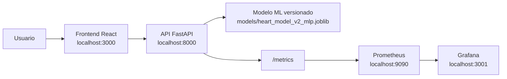
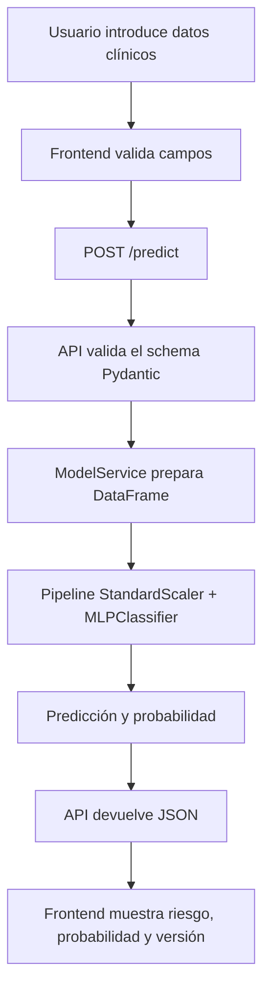
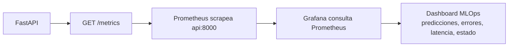

# Heart Disease MLOps


Aplicación MLOps completa para predecir riesgo de enfermedad cardíaca a partir de variables clínicas. El proyecto parte del taller base `Taller_PipelineModeling.zip` y lo transforma en una solución final con API, frontend, modelo versionado, monitorización, contenedores y documentación de presentación.

> Uso académico. Este sistema no sustituye una valoración médica real.

## 1. Descripción General

El proyecto expone un modelo de Machine Learning mediante una API FastAPI, permite hacer predicciones desde un frontend React moderno y publica métricas operativas para Prometheus y Grafana.

Servicios principales:

| Servicio | URL |
|---|---|
| Frontend React | http://localhost:3000 |
| API FastAPI | http://localhost:8000 |
| Swagger | http://localhost:8000/docs |
| Métricas | http://localhost:8000/metrics |
| Prometheus | http://localhost:9090 |
| Grafana | http://localhost:3001 |

## Demo Rápida

1. Levanta todos los servicios:

```bash
docker compose up --build
```

2. Abre el frontend en http://localhost:3000.
3. Introduce los datos del paciente y lanza una predicción.
4. Genera tráfico adicional para métricas:

```bash
python scripts/demo_requests.py --requests 25
```

5. Revisa Prometheus en http://localhost:9090.
6. Revisa Grafana en http://localhost:3001.

## 2. Objetivo

Convertir el taller inicial de despliegue de un modelo de enfermedad cardíaca en un proyecto final profesional de MLOps:

- API documentada y lista para integración.
- Modelo mejorado con red neuronal `MLPClassifier`.
- Versionado de modelos en `models/`.
- Frontend visual, responsive y útil para una demo.
- Métricas compatibles con Prometheus.
- Dashboard de Grafana provisionado.
- Ejecución reproducible con Docker Compose.
- Tests básicos con `pytest`.
- Validación automática con GitHub Actions.

## 3. Problema Que Resuelve

El taller original permitía servir un modelo desde FastAPI, pero faltaban piezas habituales en un flujo MLOps completo: interfaz de usuario, versionado explícito, monitorización, despliegue multi-servicio y documentación de arquitectura.

Este proyecto permite introducir datos clínicos de un paciente, consultar la API, obtener una predicción interpretable y observar el comportamiento del sistema con métricas.

## 4. Análisis Del ZIP Base

El ZIP `Taller_PipelineModeling.zip` contiene:

| Archivo base | Uso en este proyecto |
|---|---|
| `api_heart.py` | Se tomó como referencia para los endpoints y métricas. |
| `heart_model_wrapper.py` | Se reutilizó la idea de encapsular inferencia y postprocesado. |
| `heart_disease_model.joblib` | Se conserva como modelo antiguo en `models/heart_model_v1_logistic.joblib`. |
| `Ejercicio_Practico_Despliegue_ML.ipynb` | Se resume en `docs/taller-base.md` para no arrastrar el notebook completo. |
| `requirements.txt` | Se actualizó para el backend moderno. |
| `Dockerfile` | Se sustituyó por un Dockerfile de backend dentro de `backend/`. |

No se encontró un CSV de dataset en el ZIP. El notebook base descargaba `heart-statlog` desde OpenML y, si fallaba, creaba un dataset sintético. En esta versión no se genera dataset sintético para evitar entrenar con datos inventados.

## 5. Tecnologías Usadas

| Área | Tecnología |
|---|---|
| API | FastAPI, Pydantic, Uvicorn |
| ML | scikit-learn, `StandardScaler`, `MLPClassifier`, joblib |
| Frontend | React, Vite, lucide-react, CSS responsive |
| Métricas | prometheus-client |
| Monitorización | Prometheus, Grafana |
| Contenedores | Docker, Docker Compose |
| Tests | pytest, FastAPI TestClient |
| CI/CD | GitHub Actions |

## Validación Automática Con GitHub Actions

El repositorio incluye `.github/workflows/ci.yml`. El workflow se ejecuta en cada Pull Request y en cada push a `main`.

Validaciones incluidas:

- Backend: instala Python, instala `backend/requirements.txt` y ejecuta `pytest`.
- Frontend: instala Node, ejecuta `npm ci` y `npm run build`.

## 6. Arquitectura General



## 7. Flujo De Predicción



## 8. Flujo De Monitorización



## 9. Estructura De Carpetas

```text
heart-disease-mlops/
├── backend/
│   ├── app/
│   │   ├── main.py
│   │   ├── metrics.py
│   │   ├── model_service.py
│   │   └── schemas.py
│   ├── train_model.py
│   ├── requirements.txt
│   └── Dockerfile
├── data/
│   └── README.md
├── frontend/
│   ├── src/
│   │   ├── App.jsx
│   │   ├── main.jsx
│   │   └── styles.css
│   ├── Dockerfile
│   └── package.json
├── models/
│   ├── heart_model_v1_logistic.joblib
│   ├── heart_model_v2_mlp.joblib
│   └── model_metadata.json
├── monitoring/
│   ├── prometheus.yml
│   ├── grafana-dashboard.json
│   └── grafana/provisioning/
├── scripts/
│   └── demo_requests.py
├── tests/
│   └── test_api.py
├── docs/
│   ├── images/
│   ├── model-card.md
│   └── taller-base.md
├── .github/
│   └── workflows/ci.yml
├── Makefile
├── docker-compose.yml
├── pytest.ini
├── .gitignore
└── README.md
```

## 10. Dataset

El ZIP base no incluye un archivo de dataset. Por eso el entrenamiento está preparado en este orden:

1. Si existe `data/heart.csv`, se usa ese CSV local.
2. Si se pasa `--data-path`, se usa el CSV indicado.
3. Si no hay CSV local, se descarga `heart-statlog` desde OpenML, que es la fuente usada por el notebook del taller.

Columnas esperadas:

| Campo | Descripción |
|---|---|
| `age` | Edad |
| `sex` | Sexo codificado |
| `chest` | Tipo de dolor torácico |
| `resting_blood_pressure` | Presión arterial en reposo |
| `serum_cholestoral` | Colesterol sérico |
| `fasting_blood_sugar` | Glucosa en ayunas |
| `resting_electrocardiographic_results` | Resultado electrocardiográfico |
| `maximum_heart_rate_achieved` | Frecuencia cardíaca máxima |
| `exercise_induced_angina` | Angina inducida por ejercicio |
| `oldpeak` | Depresión ST |
| `slope` | Pendiente ST |
| `number_of_major_vessels` | Número de vasos principales |
| `thal` | Variable thal |

El script admite alias habituales del dataset UCI/OpenML, como `chest_pain`, `rest_blood_pressure`, `cholesterol`, `max_heart_rate` o `vessels`.

## 11. Modelo De Machine Learning

El modelo actual se genera con:

```text
StandardScaler + MLPClassifier
```

Archivo generado:

```text
models/heart_model_v2_mlp.joblib
```

Metadata generada:

```text
models/model_metadata.json
```

Ejemplo de metadata:

```json
{
  "model_name": "heart_disease_mlp",
  "version": "v2.0.0",
  "algorithm": "StandardScaler + MLPClassifier",
  "accuracy": 0.7407,
  "input_features": ["age", "sex", "..."],
  "model_path": "models/heart_model_v2_mlp.joblib"
}
```

## 12. Por Qué Se Usa MLPClassifier

`MLPClassifier` permite añadir una red neuronal sencilla dentro del ecosistema scikit-learn. Es adecuado para este proyecto porque:

- Encaja en un `Pipeline` junto con `StandardScaler`.
- Expone `predict` y `predict_proba`, útiles para la API.
- Es fácil de serializar con `joblib`.
- Supone una mejora conceptual frente a un modelo lineal básico del taller.
- Mantiene el proyecto entendible para una presentación académica.

## 13. Versionado Del Modelo

Los modelos se guardan en `models/` con nombre versionado:

| Versión | Archivo | Estado |
|---|---|---|
| v1 | `heart_model_v1_logistic.joblib` | Modelo original del taller conservado. |
| v2 | `heart_model_v2_mlp.joblib` | Modelo MLP actual cargado por la API. |

La API carga el modelo indicado por `models/model_metadata.json`. Si se añade una versión futura, debe actualizarse el metadata para apuntar al nuevo archivo.

## Comparativa De Modelos

| Versión | Modelo | Archivo | Estado |
|---|---|---|---|
| v1 | Regresión logística original del taller | `models/heart_model_v1_logistic.joblib` | Conservado como referencia histórica. |
| v2 | `StandardScaler + MLPClassifier` | `models/heart_model_v2_mlp.joblib` | Modelo actual usado por la API. |

La documentación detallada del modelo está en [`docs/model-card.md`](docs/model-card.md).

## 14. API FastAPI

La API carga el modelo al arrancar y expone predicciones individuales, batch, estado, información del modelo y métricas Prometheus.

### Endpoints

| Método | Ruta | Descripción |
|---|---|---|
| GET | `/health` | Estado de la API y carga del modelo. |
| GET | `/info` | Información del modelo cargado. |
| POST | `/predict` | Predicción individual. |
| POST | `/predict/batch` | Predicción para varios pacientes. |
| GET | `/metrics` | Métricas en formato Prometheus. |
| GET | `/docs` | Swagger UI de FastAPI. |

### Ejemplo De Petición A `/predict`

```bash
curl -X POST http://localhost:8000/predict \
  -H "Content-Type: application/json" \
  -d '{
    "age": 63,
    "sex": 1,
    "chest": 3,
    "resting_blood_pressure": 145,
    "serum_cholestoral": 233,
    "fasting_blood_sugar": 1,
    "resting_electrocardiographic_results": 0,
    "maximum_heart_rate_achieved": 150,
    "exercise_induced_angina": 0,
    "oldpeak": 2.3,
    "slope": 1,
    "number_of_major_vessels": 0,
    "thal": 6
  }'
```

Respuesta esperada:

```json
{
  "prediction": 1,
  "label": "Disease",
  "probability": 0.82,
  "risk_level": "High",
  "model_version": "v2.0.0",
  "inference_time_ms": 3.4,
  "probabilities": {
    "no_disease": 0.18,
    "disease": 0.82
  }
}
```

## 15. Frontend

El frontend está construido con React + Vite y consume `POST /predict` usando:

```text
VITE_API_URL=http://localhost:8000
```

Incluye:

- Pantalla principal estilo dashboard médico.
- Estado de API y modelo.
- Formulario con las 13 variables clínicas.
- Validación básica por rango.
- Tarjeta de resultado con etiqueta, nivel de riesgo, probabilidad, versión del modelo y tiempo de inferencia.
- Manejo visual de errores.
- Diseño responsive.

## Script De Demo Para Métricas

El script `scripts/demo_requests.py` genera llamadas reales a `POST /predict` para poblar Prometheus y Grafana antes de una presentación.

Uso básico:

```bash
python scripts/demo_requests.py
```

Uso con parámetros:

```bash
python scripts/demo_requests.py --api-url http://localhost:8000 --requests 25
```

El resumen por consola incluye:

- número de peticiones realizadas;
- predicciones `Disease` y `No Disease`;
- errores agrupados, si los hay;
- tiempo medio aproximado.

## 16. Prometheus

Prometheus se configura en `monitoring/prometheus.yml` y recoge métricas desde:

```text
http://api:8000/metrics
```

Métricas principales:

| Métrica | Descripción |
|---|---|
| `api_requests_total` | Requests HTTP por método, endpoint y código. |
| `api_request_duration_seconds` | Latencia HTTP. |
| `api_request_errors_total` | Errores HTTP 5xx. |
| `heart_predictions_total` | Total de predicciones. |
| `heart_prediction_errors_total` | Errores durante inferencia. |
| `heart_prediction_duration_seconds` | Latencia de inferencia. |
| `heart_predictions_by_class_total` | Predicciones por clase y nivel de riesgo. |
| `heart_model_info` | Metadata del modelo cargado. |
| `heart_api_up` | Estado de salud de la API. |

## 17. Grafana

Grafana se levanta en:

```text
http://localhost:3001
```

Credenciales por defecto:

```text
usuario: admin
password: change-me-local-demo
```

Estas credenciales son únicamente para demo local. Antes de publicar un despliegue real, define `GRAFANA_ADMIN_USER` y `GRAFANA_ADMIN_PASSWORD` en un `.env` local que no se suba al repositorio.

El dashboard se provisiona automáticamente desde:

```text
monitoring/grafana-dashboard.json
```

Paneles incluidos:

- Total de predicciones.
- Requests por endpoint.
- Errores acumulados.
- Estado de la API.
- Latencia p95 de inferencia.
- Predicciones por clase y nivel de riesgo.

## 18. Cómo Ejecutar El Proyecto

Requisito: Docker Desktop o Docker Engine con Docker Compose.

```bash
docker compose up --build
```

Después abre:

| Servicio | URL |
|---|---|
| Frontend | http://localhost:3000 |
| Swagger | http://localhost:8000/docs |
| Métricas | http://localhost:8000/metrics |
| Prometheus | http://localhost:9090 |
| Grafana | http://localhost:3001 |

Para detener:

```bash
docker compose down
```

## Comandos Útiles

El `Makefile` resume los comandos habituales del proyecto:

| Comando | Acción |
|---|---|
| `make up` | Levanta la aplicación con `docker compose up --build`. |
| `make down` | Detiene los servicios con `docker compose down`. |
| `make test` | Ejecuta `python3 -m pytest`. |
| `make train` | Reentrena el modelo con `python backend/train_model.py`. |
| `make frontend-build` | Instala dependencias del frontend y ejecuta `npm run build`. |
| `make demo` | Ejecuta `python scripts/demo_requests.py`. |

## 19. Cómo Entrenar El Modelo

Con entorno local:

```bash
python -m venv .venv
source .venv/bin/activate
pip install -r backend/requirements.txt
python backend/train_model.py
```

Con CSV propio:

```bash
python backend/train_model.py --data-path data/heart.csv
```

Salida esperada:

```text
models/heart_model_v2_mlp.joblib
models/model_metadata.json
```

## 20. Cómo Ejecutar Los Tests

```bash
pip install -r backend/requirements.txt
pytest
```

Los tests básicos están en `tests/test_api.py` y validan:

- `GET /health`
- `GET /info`
- `POST /predict`
- `GET /metrics`

GitHub Actions ejecuta estos tests automáticamente en Pull Requests y pushes a `main`.

## 21. Capturas Del Proyecto

La estructura está preparada en `docs/images/`. No se incluyen capturas falsas. Si las imágenes no aparecen todavía, ejecútalo con Docker Compose y añade capturas reales en estas rutas:

| Captura | Ruta |
|---|---|
| Frontend | `docs/images/frontend.png` |
| Swagger | `docs/images/swagger.png` |
| Prometheus | `docs/images/prometheus.png` |
| Grafana | `docs/images/grafana.png` |

### Frontend


### Swagger


### Prometheus


### Grafana


## 22. Posibles Problemas Y Soluciones

| Problema | Solución |
|---|---|
| `Model not loaded` | Verifica que existe `models/model_metadata.json` y que `model_path` apunta a un `.joblib` real. |
| Error al entrenar por dataset | Añade `data/heart.csv` o revisa la conexión a OpenML. |
| Puerto ocupado | Cambia el puerto en `docker-compose.yml` o detén el proceso que lo usa. |
| El frontend no llama a la API | Revisa `VITE_API_URL` y CORS en `CORS_ORIGINS`. |
| Prometheus no ve la API | Comprueba que el servicio `api` esté healthy y que `/metrics` responda. |
| Grafana no muestra datos | Genera tráfico con el frontend o con `curl /predict`. |

## Preparación Antes De Publicar El Repo

Antes de hacer público el repositorio, revisa:

- que no exista un `.env` real versionado;
- que no haya tokens, claves privadas, certificados ni credenciales reales;
- que `node_modules/`, `.venv/`, `__pycache__/`, logs y archivos temporales no estén en Git;
- que `.env.example` solo contenga valores de demo local;
- que las credenciales de Grafana se configuren por variables de entorno si se despliega fuera de local;
- que las capturas añadidas en `docs/images/` no muestren datos privados.

## 23. Mejoras Futuras

- Añadir validación clínica más detallada por variable.
- Registrar experimentos con MLflow.
- Añadir CI/CD con GitHub Actions.
- Persistir métricas y logs con almacenamiento externo.
- Añadir autenticación para el frontend y la API.
- Comparar varias familias de modelos antes de publicar una versión.
- Añadir capturas reales en `docs/images/` tras una demo.

## 24. Conclusión

Este repositorio convierte el taller inicial en una aplicación MLOps completa: API productiva, modelo neuronal versionado, interfaz visual, métricas, monitorización y despliegue reproducible con Docker Compose. También conserva el modelo original del taller y documenta claramente que el ZIP no incluía dataset CSV, dejando el proyecto preparado para incorporar datos locales en `data/heart.csv`.
